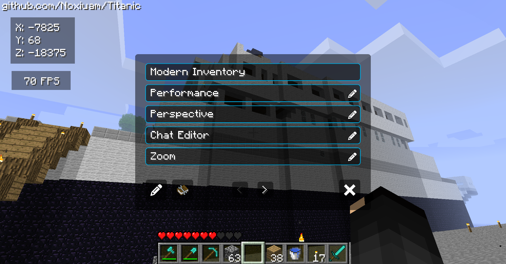

# Titanic
A QOL client for Legacy Minecraft Versions.

Join the [Discord](https://discord.gg/Q3YBDerR2k)!



## Which versions will this client support?
The client will support Beta 1.1_02 and Beta 1.7.3.

## Is this client bannable on servers?
No, we are in contact with server owners and plan to satisfy all rules.

Titanic will come with a Bukkit API that will allow servers to stop the use of certain features on the server.

## Gradle: The Build Tool Of Nightmares

`src/main/java` contains the client code; `src/minecraft/java` is for the modified game code and is ignored in favour of `patches`.

### Setup
Runs RetroMCP and and `patch`.
```
./gradlew setup
```

### Patch
Copies the source from MCP and applies the patches. This will override any changes made without `diff`!
```
./gradlew patch
```

### Diff
Generates the patches. Do this before you commit or stash otherwise your changes will be ignored!
```
./gradlew diff
```


## Development Roadmap
- [x] General designing process
- [x] Create a base for simple features, will prob use a modified version of [Settings](https://github.com/Noxiuam/Settings)
- [ ] Create a way to detect JBanned users, notify them if they are banned
- [x] Create the UI framework with different paths for each menu (it will work similarly to how endpoints work in express servers)
- [x] Implement a basic cosmetic system for capes only, wings and emotes will come at a later time
- [ ] Bukkit API to allow servers to disable certain features on the server
- [x] A menu to modify settings
- [x] Make settings and mod states save via a mod config

## Bug Fixes
- [x] Fix chunk crash when loading them too fast
- [x] Fix rendering dead entities
- [x] Fix chest inventory "chest" text not being capitalized properly
- [x] Fix armor models not moving with player swinging animation
- [x] Fix chat crash when someone sends a bunch of characters
- [x] Fix slow chunk rendering
- [x] Fix capes models when sneaking and other stuff
- [x] Fix player head model when sneaking and unsneaking
- [x] Remove "Saving level..." when on a server, it doesn't save anything
- [x] Dragging HUD mods isn't entirely perfect
- [x] When switching worlds, your skin gets set to Steve sometimes. (This appears to be fixed?)
- [ ] Fencepost rendering breaks sometimes

## QOL Suggestions Roadmap
- [x] ~~Convenient~~ Modern Inventory
- [ ] Local player tab list mod (players you have loaded since beta has no way of getting new players)
- [x] Implement screenshot taking with just F2 instead of F1 + F2
- [x] Light Level mod: Display the light level of the block you're currently standing on/looking at.

### Performance
- [x] Toggle crop rendering
- [x] Toggle block particle rendering
- [ ] Entity culling
- [ ] Block culling - Render blocks that only can be seen

### Nametags
- [x] Toggle Keybind
- [x] Text Shadow
- [ ] Text Color
- [ ] Show Own Nametag (b1.7.3+ only)
- [ ] Show Nametags in 3rd Person (b1.7.3+ only)

### Perspective
- [x] 3rd Person View Bobbing
- [x] Modern Perspective Switching
- [x] Camera FOV
- [ ] Hand FOV

### Pack Tweaks
- [x] Toggle F3 instead of holding
- [x] Reimplement Nether Portal overlay/sounds
- [x] A way to toggle fire in first person or lower its position

### Chat
- [ ] Scrolling
- [ ] Copy & Pasting
- [ ] Strip chat colors entirely
- [x] Background Toggling
- [x] Message History

### World Editor
- [x] Static time options: Morning, Noon, Evening, Midnight
- [ ] Brightness slider

### Animations
- [ ] Sword block hitting (visual only)
- [ ] Smooth sneaking animation

### Alpha 1.2.6 (if ever made)
- [ ] Pack loading like in Beta instead of overriding the JAR
